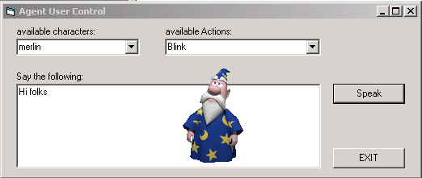

<div align="center">

## MS Agent Control Panel


</div>

### Description

Displays a combo-box containing all MS Agents currently installed on your system (retrieved by API call).

Selecting an Agent first loads the desired creature, displays it and fills a second combo-box with all possible actions they can perform. Choosing from that list lets the creature do whatever you have selected.

Additionally you can enter phrases and let them say what you have entered.

Thanks for some really good inspirations ;) on this site
 
### More Info
 


<span>             |<span>
---                |---
**Submitted On**   |2002-07-25 13:25:22
**By**             |[Andy Bretl](https://github.com/Planet-Source-Code/PSCIndex/blob/master/ByAuthor/andy-bretl.md)
**Level**          |Intermediate
**User Rating**    |5.0 (10 globes from 2 users)
**Compatibility**  |VB 6\.0
**Category**       |[Miscellaneous](https://github.com/Planet-Source-Code/PSCIndex/blob/master/ByCategory/miscellaneous__1-1.md)
**World**          |[Visual Basic](https://github.com/Planet-Source-Code/PSCIndex/blob/master/ByWorld/visual-basic.md)
**Archive File**   |[MS\_Agent\_C1108087262002\.zip](https://github.com/Planet-Source-Code/andy-bretl-ms-agent-control-panel__1-37260/archive/master.zip)

### API Declarations

```
Private Declare Function GetWindowsDirectory Lib "kernel32" Alias _
  "GetWindowsDirectoryA" (ByVal lpBuffer As String, _
  ByVal nSize As Long) As Long
```


